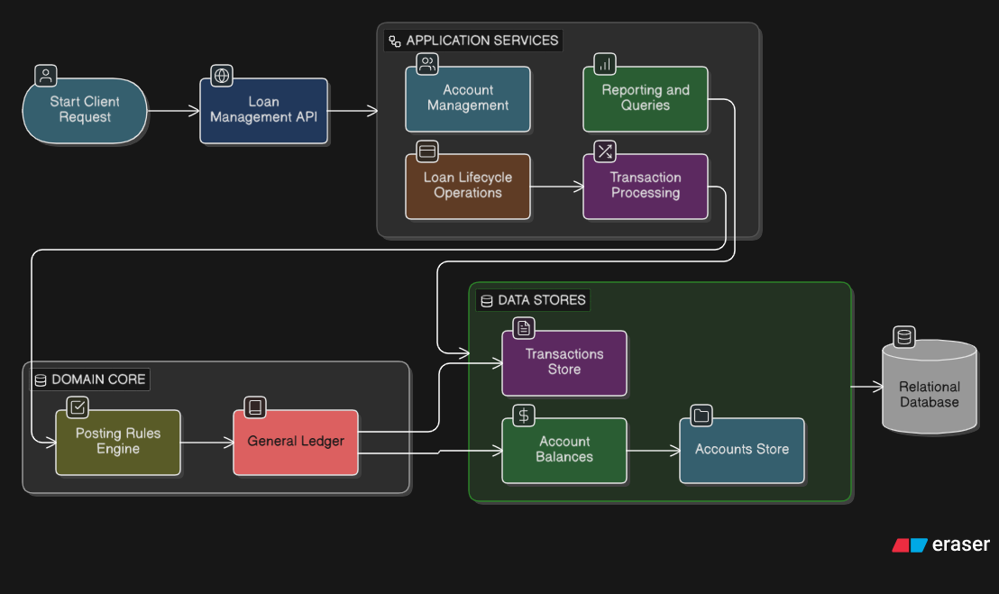

Core Banking Loan Management Service
====================================

Overview
--------

The **Core Banking Loan Management Service** is a production-grade **double-entry accounting system** designed to serve as the financial foundation for loan operations in a fintech platform.The system is built to handle **high transaction volumes** while maintaining **absolute data integrity**, auditability, and correctness.

Business Context
----------------

This service supports a digital lending platform that:

*   Disburses loans via mobile money platforms (e.g. M-Pesa)
    
*   Serves multiple lenders who pool funds
    
*   Requires real-time financial reporting
    
*   Must comply with banking regulations and audits
    
*   Processes thousands of transactions per day

High Level Architecture
-----------------------

### Architecture Overview

The Core Banking Loan Management Service is built on a layered architecture designed for scalability, maintainability, and financial accuracy:

1. **API Layer** – Handles all client requests through RESTful endpoints, managing request validation and response formatting.

2. **Business Logic Layer** – Implements core banking operations including:
   - Double-entry bookkeeping rules and validation
   - Loan lifecycle management (disbursement, repayment, write-off)
   - Account balance calculations and reconciliation

3. **Data Access Layer** – Manages persistent storage and retrieval of:
   - Chart of Accounts with hierarchical structures
   - Journal entries and transaction history
   - Account balances and audit trails

4. **Data Storage** – Relational database ensuring:
   - ACID compliance for transaction integrity
   - Concurrent access control through optimistic locking
   - Data auditability for regulatory compliance

At its core, the system implements strict **double-entry bookkeeping**, ensuring that every financial transaction is balanced, traceable, and auditable.

Core Features
-------------

### 1\. Account Management

Implements a **Chart of Accounts** supporting the following account types:

*   **ASSET** – Resources owned (Cash, Loans Receivable)
    
*   **LIABILITY** – Obligations owed (Lender Capital, Payables)
    
*   **EQUITY** – Owner’s stake (Retained Earnings)
    
*   **INCOME** – Revenue earned (Interest Income, Fee Income)
    
*   **EXPENSE** – Costs incurred (Bad Debt Expense, Operating Expenses)
    

Capabilities include:

*   Unique account identifiers
    
*   Multi-currency support (KES, UGX, USD)
    
*   Hierarchical parent–child account structures
    
*   Current and historical balance retrieval
    
*   Protection against deleting accounts with transaction history
    

### 2\. Transaction Processing

Implements **double-entry bookkeeping** with the following principles:

*   Debits increase **ASSET** and **EXPENSE** accounts
    
*   Credits increase **LIABILITY**, **EQUITY**, and **INCOME** accounts
    
*   Every transaction must balance (Debits = Credits)
    

This Service Supports:

*   Simple two-account transactions
    
*   Complex journal entries involving three or more accounts
    
*   Idempotent transaction processing
    
*   Transaction reversals via offsetting entries
    
*   Concurrency control using optimistic locking
    

### 3\. Loan Lifecycle Operations

Supports standard loan accounting workflows:

*   Loan disbursement with origination fee recognition
    
*   Loan repayment with principal and interest split
    
*   Loan default and write-off with bad debt recognition
    

All workflows produce balanced and auditable journal entries.

### 4\. Reporting Queries

Provides high-performance financial reporting, including:

*   Current and historical account balances
    
*   Transaction history with filters and running balances
    
*   Trial balance grouped by account type
    
*   Balance sheet snapshot
    
*   Loan aging analysis by delinquency buckets
    

TODO (Assessment Scope)
-----------------------

### 1.1 Account Management

*   Implement chart of accounts
    
*   Support account types: ASSET, LIABILITY, EQUITY, INCOME, EXPENSE
    
*   Create accounts with unique identifiers
    
*   Support multi-currency accounts (KES, UGX, USD)
    
*   Implement account hierarchies with parent–child relationships
    
*   Retrieve current account balances
    
*   Retrieve historical account balances
    
*   Prevent deletion of accounts with transaction history
    

### 1.2 Transaction Processing

*   Implement double-entry bookkeeping
    
*   Enforce debit and credit rules by account type
    
*   Ensure every transaction balances (Debits = Credits)
    
*   Support simple transactions involving two accounts
    
*   Support complex journal entries involving three or more accounts
    
*   Implement idempotency using idempotency\_key
    
*   Return original transaction for duplicate idempotent requests
    
*   Support transaction reversal through offsetting entries
    
*   Maintain audit trail for voided transactions
    
*   Implement optimistic locking for concurrent updates
    
*   Prevent race conditions when transactions affect the same accounts
    

### 1.3 Loan Lifecycle Operations

*   Implement loan disbursement accounting
    
*   Record loan receivable on disbursement
    
*   Record loan origination fee receivable and fee income
    
*   Implement loan repayment accounting (principal and interest split)
    
*   Implement loan default and write-off accounting
    
*   Record bad debt expense on loan write-off
    

### 1.4 Reporting Queries

*   Implement current account balance report
    
*   Implement historical account balance (as-of date/time)
    
*   Ensure account balance queries meet < 50ms performance requirement
    
*   Implement transaction history report
    
*   Support pagination for transaction history
    
*   Support filtering by date range and transaction type
    
*   Include running balance in transaction history
    
*   Implement trial balance report
    
*   Ensure trial balance always balances (audit critical)
    
*   Group trial balance by account type
    
*   Implement balance sheet report (Assets = Liabilities + Equity)
    
*   Implement loan aging report
    
*   Categorize loans into aging buckets (0–29, 30–59, 60–89, 90+ days)
    
*   Display loan count and total amount per aging bucket